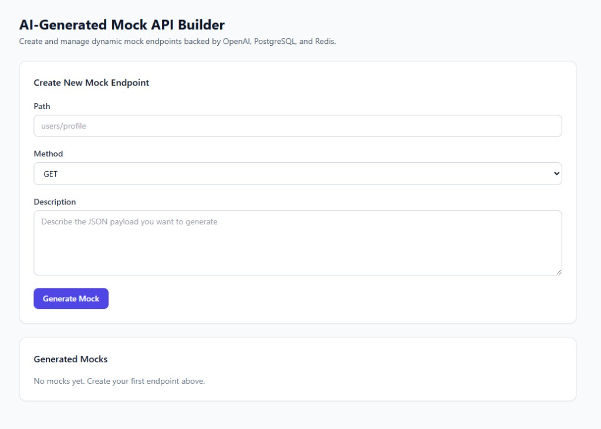
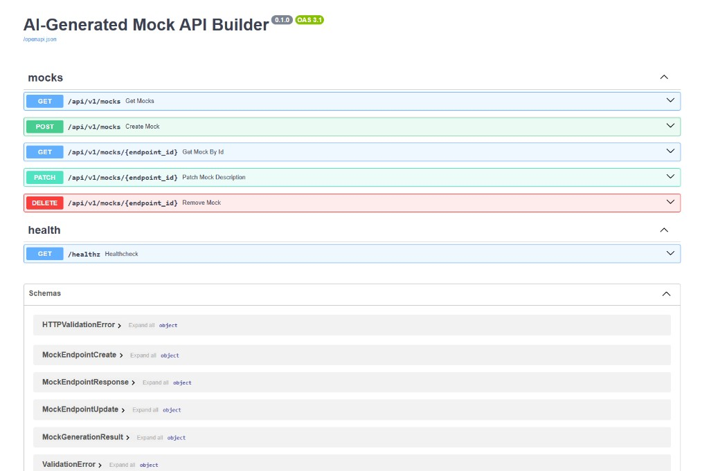

# 🤖 AI-Generated Mock API Builder (MVP)

Продакшн-ready инструмент для динамической генерации фейковых эндпоинтов по текстовому описанию.
Идеально для фронтенд-разработчиков и QA, которым нужно «ручку» прямо сейчас.

## 🏗️ Архитектура системы

- **Frontend**: React + TS + Vite + Tailwind (порты **80** и **8080** в Docker).
- **Backend**: FastAPI (Python 3.11) + SQLAlchemy 2.0 (порт 8000).
- **Cache**: Redis 7 (для мгновенной отдачи моков).
- **Database**: PostgreSQL 15 (для метаданных).
- **Reverse Proxy**: Nginx (раздача фронта и маршрутизация /api).

## 📸 Скриншоты

### Dashboard



### Swagger / OpenAPI



---

## 🚀 Быстрый запуск (One-command start)

1. **Подготовьте окружение**:

   ```bash
   cp .env.example .env
   ```

   *Обязательно добавьте ваш `OPENAI_API_KEY` в созданный `.env` файл.*

2. **Запустите проект**:

   ```bash
   docker compose up --build -d
   ```

3. **Проверьте статус**:
   Все сервисы должны иметь статус `healthy`. Бэкенд дождется готовности БД и Redis перед стартом.

   ```bash
   docker compose ps
   ```

### Стабильные сборки

1. **Frontend в Docker**: образ сам делает `npm install --package-lock-only` и затем **`npm ci`** (без «долгого» `npm install` по умолчанию и без обязательного `package-lock.json` в репозитории). По желанию закоммитьте `frontend/package-lock.json` после `cd frontend && npm install`, чтобы версии зависимостей совпадали с локальной разработкой.

2. **Backend**: в build-stage ставится `build-essential` через `apt` (нативные колёса). При обрывах зеркал Debian — повторите `docker compose build --no-cache` или проверьте прокси Docker.

3. В runtime backend **нет** `apt`/`curl` — healthcheck через **Python** (`urllib`).

### Если в браузере «Welcome to nginx!»

Обычно **порт 80 занят не Docker**, а другим Nginx/IIS/службой на Windows. Откройте **http://localhost:8080** (тот же фронтенд из контейнера) или остановите лишний веб-сервер на :80. Проверка: `docker compose ps` и `curl -sI http://127.0.0.1:8080` — в ответе должен быть ваш SPA (заголовок страницы «Mock API Builder»).

---

## 🔗 Точки доступа

| Сервис | URL | Описание |
| :--- | :--- | :--- |
| **Dashboard** | http://localhost или http://localhost:8080 | Интерфейс управления моками |
| **Backend API** | http://localhost:8000/api/v1/mocks | Management API (документация: http://localhost:8000/docs) |
| **Mock API** | http://localhost/m/{path} или http://localhost:8080/m/{path} | Динамические эндпоинты |

---

## 🛠️ Инструкция для SRE (Observability & Maintenance)

### 📊 Логирование

Все контейнеры настроены на ротацию логов (max 10MB, 3 файла). Для просмотра в реальном времени:

```bash
docker compose logs -f backend
```

### 🧬 Проверка здоровья (Healthchecks)

- **Postgres**: Используется `pg_isready`.
- **Redis**: Используется `redis-cli ping`.
- **Backend**: HTTP-запрос к `/healthz` через встроенный Python (`urllib`) внутри контейнера.

### 🧹 Очистка данных

Чтобы полностью сбросить состояние (удалить БД и кэш):

```bash
docker compose down -v
```

---

## 💡 Как это работает (Workflow)

1. Вы заходите в дашборд и вводите промпт: *"Верни мне список из 5 заказов с полями id, status, price и списком товаров"*.
2. Бэкенд просит OpenAI сгенерировать JSON по этому описанию.
3. Результат сохраняется в **Redis** по ключу пути (например, `mock_api:GET:orders` для `GET /m/orders`).
4. Фронтенд или мобильное приложение теперь могут делать запрос на `http://localhost/m/orders` и получать моментальный ответ без нагрузки на основную БД.

---

## ⚠️ Рекомендации перед продакшном

- **Rate Limiting**: В текущем MVP нет ограничений на количество запросов к OpenAI. Добавь лимит в FastAPI через `slowapi`, чтобы один активный пользователь не обнулил твой баланс OpenAI за минуту.
- **CORS**: Если включишь CORS для продакшна, ограничь `allow_origins` только своим доменом (в MVP фронт ходит через Nginx proxy, отдельный CORS часто не нужен).
- **Secrets**: Для реального деплоя (Railway/AWS) не храни `.env` в репозитории — добавь `.env` в `.gitignore` и используй секреты платформы.
